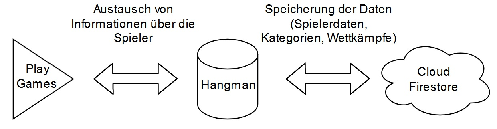

# Galgenmännchen

In unserem Projekt im Rahmen des **Android-Praktikums** im Wintersemester 2021/22 haben wir das Spiel [Galgenmännchen](https://de.wikipedia.org/wiki/Galgenmännchen) programmiert.

In unserer Software gibt es zwei verschiedene Spielmodi: *Singleplayer* und *Multiplayer*

### Singleplayer

Im Singleplayer kann man eine *Kategorie* auswählen, aus welcher der Spieler ein *zufälliges* Wort bekommt. Rät der Spieler einen falschen Buchstaben, so wird dieser Rot markiert. Wird ein Buchstabe richtig geraten, so wird dieser Grün markiert und auf dem entsprechenden Feld eingefügt.

### Multiplayer

Im Multiplayer treten zwei Spieler in einem sogenannten Raum gegeneinander an.
Dabei können die Spieler entweder ein eigenes Wort eingeben oder ein Wort aus einer Kategorie auswählen.
Dieses Wort muss dann der Gegner erraten. Wer am Spielende die wenigsten Fehlversuche hat, gewinnt das Spiel.
Haben beide Spieler die maximalen Fehlversuche verbraucht, so gibt es ein Unentschieden.
Spieler können selbst Räume mit einem 3-stelligen Zahlencode erstellen. Existiert bereits dieser Raum, so wird eine Fehlermeldung ausgegeben.

### Profile

Des Weiteren gibt es im Hauptmenü die Möglichkeit das eigene Profil anzuschauen. Dabei werden dem Benutzer seine Statistiken zu Singleplayer und Multiplayer angezeigt. Hierbei sieht man die insgesamt gespielten Spiele, sowie Siege, Niederlagen und das Verhältnis von Sieg zu Niederlagen.

### Anforderungen

Damit die App vollständig und fehlerfrei läuft, werden die neueste Version von **Play Games**, ein **Google Account** und ein Android-Gerät mit mindestens **API Level 24** und **Internetzugang** benötigt.

## Systemarchitektur

Unsere App funktioniert ausschließlich mit Play Games und Cloud Firestore. Ein Benutzer muss sich nicht zwingend über Play Games anmelden. In diesem Fall werden die Daten nur lokal gespeichert und gehen bei Deinstallation verloren.

## Softwarearchitektur

Strukturell ist unsere Architektur wie folgt aufgebaut:
- Ein Hauptmenü mit drei verschiedenen Optionen
    - Singleplayer
    - Multiplayer
    - Profile
- Eine Kategorieauswahl beim Singleplayer; Anschließendes Singleplayerspiel und Zurückkehren zum Hauptmenü.
- Eine Raumerstellung beim Multiplayer; Wortauswahl; Multiplayer-Spiel; Ergebnisbildschirm mit Sieger / Verlierer am Ende; Zurückkehren zum Hauptmenü.
- Beim Zurückknopf kommt man jeweils einen Schritt zurück, es sei denn man ist am Spielen, dann wird man zunächst gefragt, ob man Verlassen möchte, dann kommt man je nach Spielmodus zu einem anderen Screen:
    - Singleplayer: Kategorieauswahl
    - Multiplayer: Raumauswahl
- Wenn man beim Ergebnis "Zurück" drückt, gelangt man nach einer Bestätigung in das Hauptmenü.

## Technische Umsetzung

Wir haben unsere App mit Hilfe von Android Studio programmiert. Als Programmiersprache wurde Kotlin ausgewählt. Es müssen keine speziellen Veränderungen an der IDE vorgenommen werden, um mit der Entwicklung zu beginnen. Außerdem haben wir Cloud Firestore / Firebase zur Sicherung der Daten und Play Games zur Authentifizierung von Benutzern verwendet. Die Versionen sind nachfolgend aufgelistet:

- Kotlin (1.6.10)
- Gradle (7.3.3)
- Firebase BoM (29.0.3)
- Firebase UI Auth (8.0.0)
- Play Service Games (22.0.1)
- Play Service Auth (20.0.1)
- Play Service Location (19.0.1)
- Splash Screen (1.0.0)
- Android Fragments (1.4.0)
- Android Recyclerview (1.2.1)
- Android Recyclerview Selection (1.1.0)

Das Projekt wurde mit dem Versionskontrollwerkzeug Git unter GitLab entwickelt. Dabei wurde das Prinzip der Feature Branches angewendet. Das bedeutet, dass es für jedes neue Feature einen eigenen Branch gibt, welcher später mit dem Hauptprojekt gemerged wird. Eine wichtige Bemerkung an dieser Stelle sei auch die Realisierung der UI mit Hilfe von sogenannten "Fragments" anstelle von Activities, welche den Vorteil haben, dass Änderungen an der Benutzeroberfläche schneller und flüssiger ablaufen.
